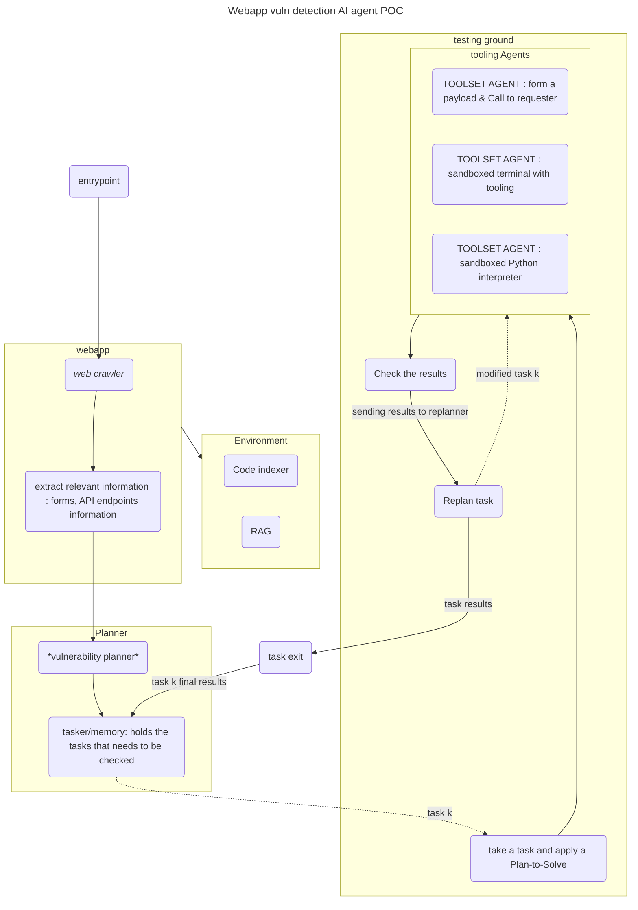
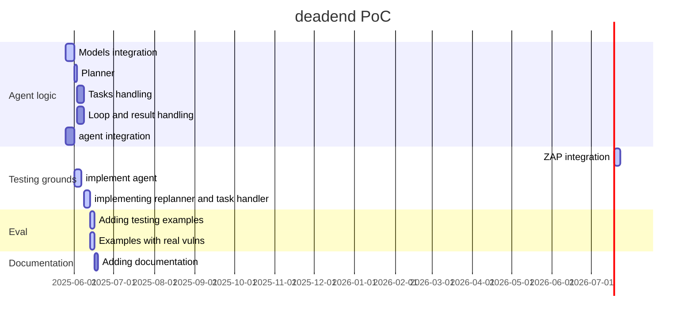

# DeadEnd : Web App AI agent 

DeadEnd is an AI agent tooling for web app vulnerability research. It's about finding that *needle in stack*. About following a methodic plan to help security researchers and pentesters find and test that potential issue. 


## web vulnerability detection and reasoning 


### Type of vulnerabilities 

The type of vulnerabilities that we focus on are the vulnerabilities where it is difficult to find with automated tools, and when an analysis of multiple traffic points and setup is necessary. 

These type of vulnerabilities could be made faster using an AI agent. We're targeting the following : 
- [ ] IDORs
- [ ] Business logic vulnerabilities
- [ ] Chaining several vulnerabilities 
- [ ] Exploit POC development and testing  

## AI agent Implementation graph

We have the following hypothesis : 
- Target information : IP domain source code... 
- API endpoints : A swagger UI spec of openapi spec 
- Authentication information if necessary (could be gathered through the proxy)

As a matter of fact, these hypothesis are automatable, through fuzzing and recon. *Security researchers and pentesters* usually have their own tools and scripts to recon a target. 




### Webpage retriever 

Webapp retriever has several goals. 
1. Establish a connection with target. 
2. the webpage should also be retrieved by awaiting a browsing from user. 
3. Verify the information given in the hypothesis. 
4. If html/js response, retrieve forms and API url in the page. 

### Planner 
Vulnerability planner: gets the information from the retriever section. Defines the possible attack vector depending on the analysis. 
generate sequential tasks to look at. 
*suggested prompt (Plan-and-Solve-Prompting)*
```
You are given information about the target :
{target information}
The precedent task result is : 
{task n result}
Let's start by understanding the problem and the results. 
From the information given on the target and the results, extract the relevant information, code, API endpoints and variables, and devise a plan. 
Then let's carry out the plan, try to identify where a vulnerability lies and if you see that there is a way to exploit a particular flaw, check if the results doesn't not include it, and add it as a task to test if the vulnerability triggers, understand the potential flaw step-by-step and show the answer.  
```


### Testing grounds 
Testing grounds takes a unique general task, that had a prior analysis by the planner. The task could be for example, `The code section {...} might be vulnerable to XSS injection`. 

A subplan, specific to the task in hand, is generated. This subplan is a reasoning zero-shot plan, that generates a vulnerable payload to trigger the vulnerability. The plan is for reasoning step-by-step. The multi-step is here to be able to generate the correct payload that is semantically valid, but could have a capability of randomness for the actual trigger. 

## deadend PoC implementation (Proof-of-Concept)

### Requirements 
Structure information.
- Model definition
    - LLM call
    - System Prompt
    - Plan-and-Solve Templates 
    - ReAct agent
- Target structure definition
    - Domain
    - API specification
    - source crawl


### Planner

### Testing grounds


### Web App proxy agent : built on top of zap proxy. 

The agent must analyse the following structure to be able to respond correctly. 

The tool itself must have the following parts : 
- catch/await request from the browser
- send requests and get responses -> to database/register them

## project timeline 



## User interface

> The starting point here is to figure out a way to use this architecture from a user stand point. It is important to understand how each component can be used with what we already know best. 

### Forms for gather target information
A form-like section is needed to insert the most important information. 
This could include the target domain name, openAPI spec, the scope of target, and other information related to the target that might be interesting to add.  

### Interaction with other tools 
Tools, like burp proxy for example, should be able to be used by the end-user. the requests should be possible to be redirected to that proxy if needed. 

### Interacting with source code
depending on the code that we will be reviewing, accessing it through an editor might be interesting. To be decided.

### Terminal interaction 
The interaction with the terminal is necessary. As pentesters we have a heavy use on terminals to run our tools. 

### The python interpreter for exploits dev and simple interactions
The python interpreter toolset is an agent that could run python scripts. This could be used to test exploits and tools alike. 

### Agent's representation and following
The agent should be able to be ran at any point and certainly stopped at any point to continue the usual analysis or running our tools. 
Human-in-the-loop is pretty much necessary here. 
