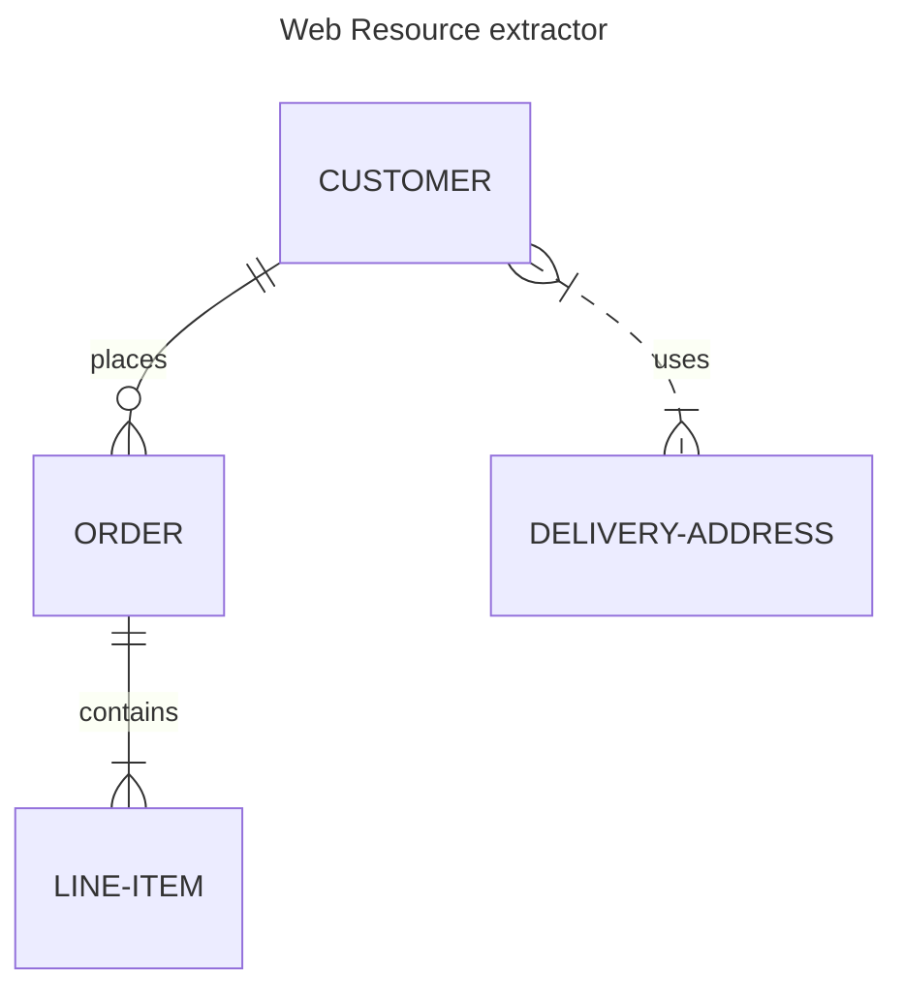

# Web resource extractor 

## Overview 
The web resource extractor is the tool that extract the web page's every resource so that it can be passed to the code indexer. 

## Tools used 
We cannot use a simple crawler for retrieve the HTML page and JS files located in `script` tags, because we need to include single page applications that are often the case these days. 
Thus, we use playwright to extract information on a website. With it, we can extract dynamically loaded resources, service workers, modules and other that can be important to analyse.

## Implementation and constraints

The data needs to be registered in the cache folder (represented by `$HOME/.cache/deadend/domains/`).

There is the following two cases that are taken into account.

### The target was never extracted before
When a URL is targeted, we extract the domain name and create a folder corresponding.
We then extract the all the ressources needed into a `json` file, containing all the information. 
The `json` file contains the following information: 

```python 
class Resource:
    url: str
    resource_type: str
    method: str
    hash: str | None = None 
    status_code: int | None = None
    size: int | None = None
    mime_type: str | None = None
    from_cache: bool = False
    failed: bool = False
    timing: Dict | None = None 
```

### The target already exists in the cache
If the folder exists, it means that the target has already been 


